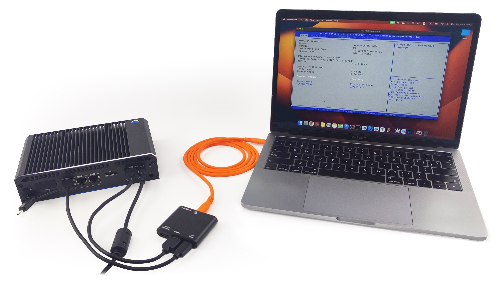

# Openterface Mini-KVM: Documentation & Site du Produit

Bienvenue sur le dépôt officiel de l'**Openterface Mini-KVM** — un gadget KVM USB portable et plug-and-play pour le contrôle au niveau BIOS, le dépannage local et le partage de fichiers, le tout sans nécessiter de connexion réseau.

> 💡 Ce dépôt alimente le **site web officiel du produit Openterface Mini-KVM** via GitHub Pages. Il n'est *pas* destiné à être auto-hébergé. Au lieu de cela, c'est le lieu de notre documentation, des informations de conformité, des liens de téléchargement de logiciels et d'autres ressources liées au produit.

---

## 🌟 Qu'est-ce que l'Openterface Mini-KVM ?

L'**Openterface Mini-KVM** est une solution KVM compacte open-source basée sur USB qui vous permet de contrôler un ordinateur cible (par exemple, un serveur sans tête ou un système embarqué) en utilisant votre machine hôte — il suffit de brancher les câbles USB et HDMI, sans réseau ni pilotes requis.

🔧 Conçu pour :
- Les professionnels de l'IT gérant des configurations sans tête
- Les développeurs utilisant des SBC comme Raspberry Pi
- Les ingénieurs en systèmes embarqués
- Toute personne ayant besoin d'un **accès portable au niveau BIOS**

📦 Caractéristiques :
- Capture HDMI + USB pour la vidéo, le clavier et la souris
- Partage de fichiers direct via port USB
- Temps de démarrage inférieur à 1s
- Application hôte multiplateforme (macOS, Windows, Linux, Android)
- Matériel et logiciel entièrement open-source
- Certifié CE, UKCA, RoHS, WEEE
- Certifié OSHWA : [UID CN000015](https://certification.oshwa.org/cn000015.html)

📖 En savoir plus : [Les bases du KVM-over-USB](https://openterface.com/faq/usbkvm/kvm-over-usb/), [Openterface Mini-KVM](https://openterface.com/faq/minikvm/op-minikvm/)

---

## 📲 Télécharger l'Application Hôte

Pour utiliser le Mini-KVM, installez l'**application côté hôte** correspondante sur votre ordinateur ou mobile :

- 💻 [Versions Windows, macOS, Linux, Android & code source](https://openterface.com/app/)
- 📺 [Regarder les démos sur YouTube](https://youtube.com/@TechxArtisan)

> ⚠️ Toutes les applications sont open source et testées par la communauté. Soyez prudent lors de l'utilisation de forks tiers — les outils KVM gèrent des entrées sensibles.

---

## 🔓 100% Open Source & Certifié

Nous prenons l'ouverture au sérieux. Notre matériel et nos logiciels sont entièrement transparents et certifiés.

- 📘 [Logiciel sous licence AGPL-3.0](https://openterface.com/compliance/)
- 🛠 [Matériel certifié OSHWA](https://openterface.com/compliance/)
- 📦 [Fichiers sources du matériel](https://github.com/TechxArtisanStudio/Openterface_Mini-KVM_Hardware)

---

## ❓ FAQ & Cas d'Utilisation

Découvrez comment le Mini-KVM se compare aux KVM basés sur IP et aux KVM logiciels :

- ⚙️ [Cas d'utilisation & Tableaux comparatifs](https://openterface.com/faq/usbkvm/kvm-over-usb/)
- 🤔 [Pourquoi Openterface ?](https://openterface.com/faq/usbkvm/openterface/)
- 🧑‍💻 [Support technique, Discord & Communauté](https://openterface.com/discord)

---

## 🌐 À Propos de ce Dépôt

Ce dépôt est :

- La **source du site web Openterface Mini-KVM** (hébergé via GitHub Pages)
- Un hub pour la documentation du produit, les liens logiciels et les références de conformité
- Maintenu par [TechxArtisan](https://techxartisan.com), les créateurs de la famille Openterface

💌 Des questions ou des idées ? Envoyez-nous un email à [info@openterface.com](mailto:info@openterface.com) ou [rejoignez notre Discord](/discord)

---

**💬 Vous avez des commentaires sur ce site ?**  
[Faites-le nous savoir ici.](https://forms.gle/wmxoR2C1VdG36mT69)
