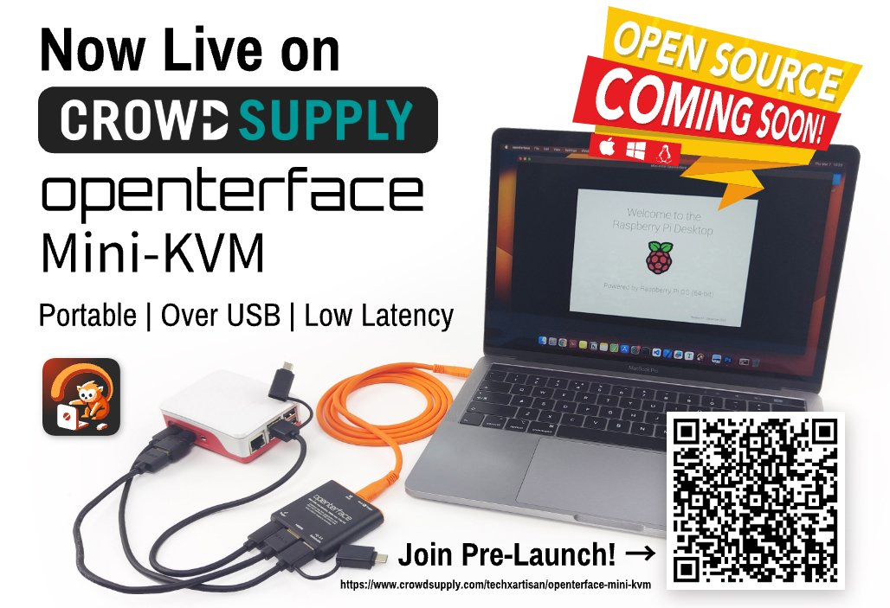

Ce référentiel GitHub héberge le site web pour le [Openterface Mini-KVM](https://fr.openterface.com/), un appareil KVM compact et riche en fonctionnalités qui est open-source et soutenu par [une communauté dynamique](https://fr.openterface.com/community/).

Nous avons atteint un moment crucial : notre [campagne de financement participatif](https://www.crowdsupply.com/techxartisan/openterface-mini-kvm) est maintenant en ligne sur **Crowd Supply** ! Nous avons dépassé notre objectif de 12 000 $ en quelques heures à peine ! Vous êtes incroyables ! Continuons sur cette lancée ! Pensez à vous abonner et à nous soutenir pour aider à amener le Mini-KVM Openterface chez vous plus rapidement. Venez nous rejoindre dans notre [communauté](https://fr.openterface.com/community/) !

**[Openterface Mini-KVM](https://fr.openterface.com/)** vous permet de contrôler un appareil cible sans écran, tel qu'un mini PC, un kiosque ou un serveur, directement depuis votre ordinateur portable ou de bureau sans avoir besoin d'un clavier, d'une souris et d'un moniteur supplémentaires.

C'est un outil plug-and-play qui se connecte via HDMI pour l'affichage et USB pour les signaux émulés de clavier/souris (HID). Il nécessite une configuration minimale : installez notre application hôte sur votre ordinateur hôte, et vous êtes prêt à avoir un contrôle sans écran en déplacement.

Découvrez-en plus sur notre [page FAQ](https://fr.openterface.com/faq/).

## Contrôlez vos appareils quand et où vous voulez

Que vous soyez un professionnel de l'informatique ayant besoin de dépanner un serveur, un développeur gérant plusieurs tests sur des machines de calcul en périphérie, un passionné de technologie piratant des ordinateurs monocartes, ou simplement quelqu'un cherchant à désencombrer son bureau, Openterface Mini-KVM est la solution.

Découvrez-en plus sur nos [cas d'utilisation](https://fr.openterface.com/use-cases/).

## Caractéristiques et spécifications

- **Compatibilité de l'application hôte** : Actuellement compatible avec macOS, avec prise en charge de Windows et Linux en développement.

- **Commodité plug-and-play** : Contrôle sans écran via HDMI et clavier/souris émulés, sans souci de réseau.

- **Portabilité** : Son design compact et léger en fait l'outil parfait pour les professionnels en déplacement.

- **Transfert de texte de l'hôte à la cible** : Idéal pour copier des noms d'utilisateur, mots de passe et petits morceaux de code vers l'ordinateur cible via nos applications hôtes.

- **Full HD avec faible latence** : Capture de la vidéo via HDMI en résolution 1920x1080 à 30fps, avec une latence inférieure à 140 millisecondes. Avec l'aide d'un adaptateur vidéo, il peut également prendre en charge les sources vidéo DisplayPort et DVI.

- **Intégration audio** : Capture et joue l'audio de l'appareil cible directement sur l'ordinateur hôte.

- **Accès au niveau du BIOS** : Fournit un accès direct au BIOS, au firmware ou à la gestion du démarrage de l'appareil cible.

- **Port USB Type-A commutable** : Permet de basculer l'accès USB entre l'hôte et la cible, idéal pour partager un disque USB sans le rebrancher.

- **Configuration propre** : Ne laisse aucun logiciel sur l'ordinateur cible.

En savoir plus sur les [spécifications](https://fr.openterface.com/specifications/).

## Installer l'application hôte

Pour utiliser ce mini-KVM, l'ordinateur hôte doit installer l'une des applications hôtes ci-dessous. 

- [Openterface_MacOS](https://github.com/TechxArtisanStudio/Openterface_MacOS) (En cours de réalisation) : Pour la prise en charge de macOS ; L'application macOS est également sur l'App Store d'Apple, en recherchant "Openterface".
- [Openterface_QT](https://github.com/TechxArtisanStudio/Openterface_QT) (En cours de réalisation) : Pour la prise en charge de Windows et Linux.
- [Openterface_Android](https://github.com/TechxArtisanStudio/Openterface_Android) (En cours de réalisation) : Pour la prise en charge d'Android.
- [Openterface_WebExtension](https://github.com/TechxArtisanStudio/Openterface_WebExtension) (En cours de réalisation) : Application web pour l'extension Chrome/Firefox.

## Engagement open-source

Les applications hôtes mentionnées ci-dessus sont en cours de développement actif. Notre équipe code et affine ces outils avec diligence pour améliorer leurs performances et leur fonctionnalité. Notre engagement envers le matériel open-source et les logiciels open-source reste ferme, et nous divulguerons plus de détails tout au long de la campagne.

Nous préparons actuellement le code pour une publication publique en nettoyant et organisant nos dépôts.

Si vous êtes impatient de contribuer et souhaitez rejoindre notre équipe de développement, [contactez-nous dès aujourd'hui](mailto:info@techxartisan.com) et aidez à façonner l'avenir de la technologie ! 🚀

## Restez en contact et restez informé

Nous sommes ravis que vous pensiez à nous contacter ! Si vous avez des questions, des retours ou simplement envie de dire bonjour, rendez-vous sur notre [page de contact](https://fr.openterface.com/contact/) pour découvrir toutes les façons dont vous pouvez nous contacter.

Pour rester informé et vous engager avec notre communauté, suivez-nous sur nos réseaux sociaux :

- **Reddit** : [Rejoignez notre subreddit](https://www.reddit.com/r/Openterface_miniKVM/)
- **Discord** : [Rejoignez notre communauté Discord](https://discord.gg/sFTJD6a3R8)
- **Twitter** : [Suivez-nous sur Twitter](https://twitter.com/TechxArtisan)
- **YouTube** : [Abonnez-vous à notre chaîne YouTube](https://youtube.com/@TechxArtisan)
- **Facebook** : [Aimez-nous sur Facebook](https://www.facebook.com/TechxArtisan)
- **LinkedIn** : [Suivez-nous sur LinkedIn](https://www.linkedin.com/company/techxartisan/)

Rejoignez la conversation et faites partie de notre communauté grandissante !