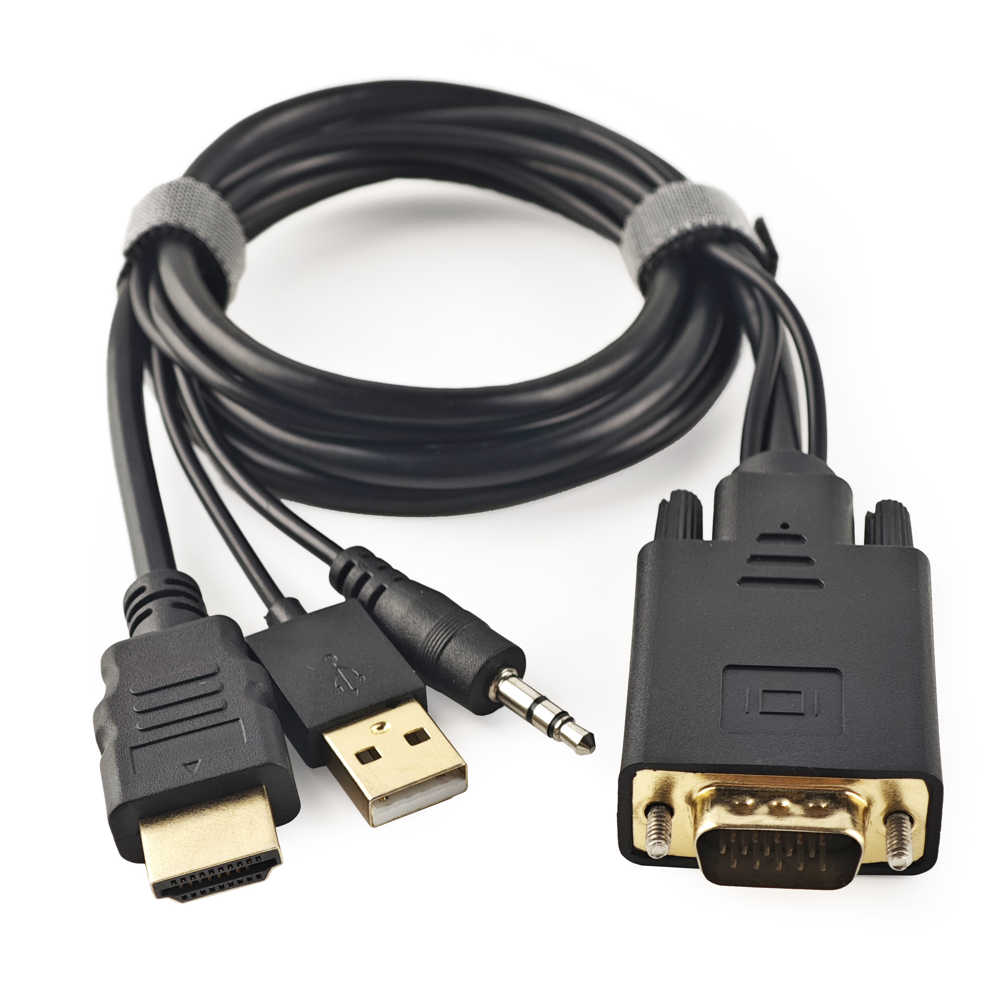
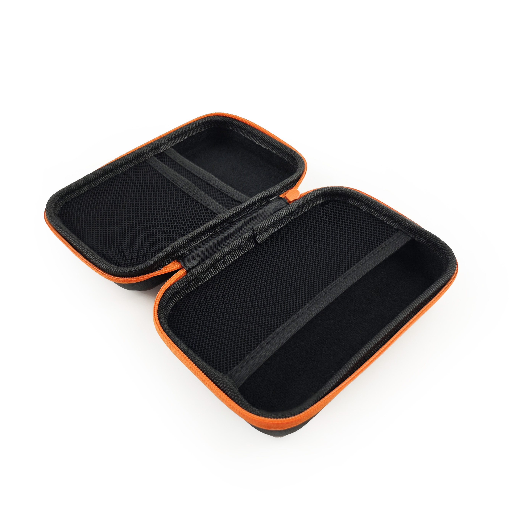

# Accessoires

Découvrez ici une gamme de produits qui complètent et améliorent la fonctionnalité du Mini-KVM Openterface. Nous proposons divers accessoires pour rendre votre expérience avec notre Mini-KVM encore plus polyvalente et pratique.

## Câble Convertisseur VGA vers HDMI

{:style="height:360px"}

Ce produit convertit la vidéo VGA et intègre l'audio en HDMI, permettant une connexion facile des appareils VGA aux écrans HDMI.

- **Modèle**: CABLE100-VGA2HDMI
- **Longueur**: 1M
- **Résolution Vidéo de Sortie**: 1920x1080P Full HD
- **Entrée Audio**: Prise audio 3,5 mm
- **Sortie Audio**: via HDMI
- **Alimentation**: Alimenté via USB

### Cas d'Utilisation
Pour un exemple détaillé de l'utilisation de ce câble, veuillez visiter [Gestion de Serveur Simplifiée](/use-cases/#streamlined-server-management).

### Vidéo Démonstrative
Regardez la vidéo de démonstration par l'influenceur tech **Cameron Gray** sur l'utilisation de ce câble avec le Mini-KVM : [Ce KVM USB est génial !](https://youtu.be/xAEQpWyfY-c?si=auB5NtqHVw2C7iIK&t=1693)

<button class="md-button" onclick="window.location.href='https://www.crowdsupply.com/techxartisan/openterface-mini-kvm#products'">Passer Commande</button>

---

## Câble Type-C vers USB-A avec Adaptateur

{:style="height:360px"}

Ce câble polyvalent Type-C Mâle vers USB-A Mâle, accompagné d'un adaptateur USB-A Femelle vers USB-C Mâle, offre une connectivité flexible aux appareils cibles. Il permet le transfert de données et la transmission des signaux de contrôle du clavier et de la souris, que l'appareil cible utilise un port USB-A ou Type-C.

- **Longueur**: 0,3m
- **Couleur**: Noir
- **Adaptateur**: USB-A Femelle vers USB-C Mâle
- **Utilisation**: Facilite le contrôle et le transfert de données vers l'appareil cible.

---

## Câble Type-C vers Type-C avec Adaptateur

{:style="height:360px"}

Ce câble Type-C Mâle-à-Mâle élégant et doux au toucher, en orange vif, est conçu pour les connexions d'ordinateurs hôtes. Il est livré avec un adaptateur USB-C Femelle vers USB-A Mâle pour une compatibilité accrue, vous permettant de vous connecter aux ordinateurs hôtes utilisant des ports Type-C ou USB-A. De plus, ce câble prend en charge la **charge rapide de 240W** (Tension DC50V, Courant 5A, Puissance 240W), ce qui le rend parfait non seulement pour nos Mini-KVMs mais aussi pour charger votre téléphone portable ou votre ordinateur portable.

- **Longueur**: 1,5m
- **Couleur**: Orange
- **Adaptateur**: USB-C Femelle vers USB-A Mâle
- **Utilisation**: Pour un transfert de données à haute vitesse entre l'ordinateur hôte et le Mini-KVM, et pour la charge rapide des téléphones portables ou des ordinateurs portables.

---

## Câble HDMI Mâle-à-Mâle

{:style="height:360px"}

Ce câble HDMI compact est parfait pour connecter votre appareil cible afin de capturer la sortie vidéo, assurant une intégration transparente avec votre Mini-KVM Openterface.

- **Longueur**: 0,3m
- **Couleur**: Noir
- **Utilisation**: Idéal pour la transmission vidéo haute définition de l'appareil cible vers le Mini-KVM.

---

## Sac à Outils Openterface

{:style="height:360px"}

Gardez votre Mini-KVM Openterface et ses accessoires organisés et portables avec ce sac à outils compact. Doté d'une fermeture éclair orange élégante et de poches en maille extensible, ce sac assure une excellente gestion des câbles et une facilité de transport, parfait pour les professionnels de l'informatique en déplacement.

- **Dimensions**: 180 x 115 x 50mm
- **Couleur**: Noir avec fermeture éclair orange
- **Utilisation**: Idéal pour ranger et organiser votre Mini-KVM et ses câbles.

---

## Capuchon d'Extension

{:style="height:360px"}

Ce capuchon d'extension imprimé en 3D remplace le capuchon d'origine du Mini-KVM Openterface, permettant aux utilisateurs avancés d'exposer et d'accéder aux broches d'extension pour un développement personnalisé. Vous pouvez télécharger les fichiers du modèle 3D depuis notre dépôt GitHub et imprimer le capuchon vous-même.

- **Utilisation**: Fournit un accès aux broches d'extension pour le développement matériel avancé.
- **Téléchargement**: [Fichiers du Modèle 3D](https://github.com/TechxArtisanStudio/Openterface_Mini-KVM_Hardware/tree/main/models)

---

## Plus à Venir

Restez à l'écoute pour plus d'accessoires qui seront ajoutés à cette section, conçus pour améliorer votre expérience avec le Mini-KVM Openterface.