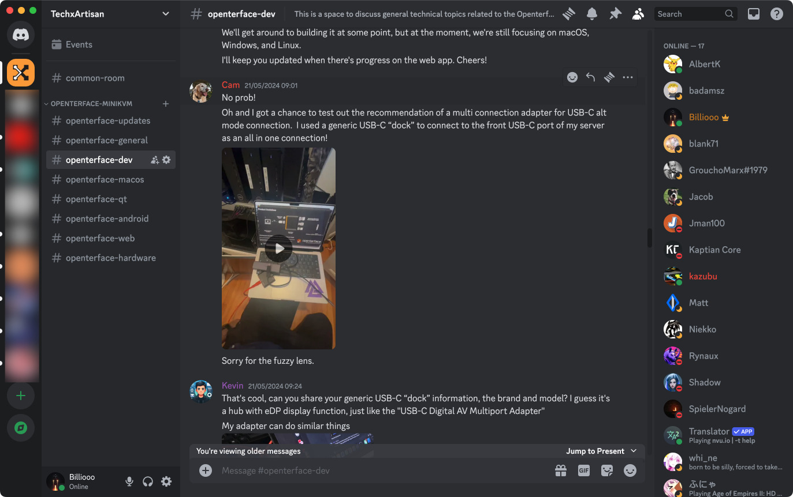

# Casual Chat avec David Groom de MAKE : Magazine : L'histoire du Mini-KVM d'Openterface 🎙️

Bonjour à tous !

Nous venons de terminer un [YouTube livestream] (https://www.youtube.com/live/lwitzvmxsgc?si=s9a1t5_Sce5v22e1) génial avec David Groom de MAKE : Magazine ! Pendant la session, nous avons approfondi l'histoire de notre Openterface Mini-KVM, une solution matérielle open-source innovante conçue pour contrôler sans effort des appareils sans tête et des ordinateurs monocartes comme les Raspberry Pis en utilisant simplement votre ordinateur portable. Vous pouvez regarder le livestream sur YouTube pour plus de détails ou simplement lire l'histoire ci-dessous.

<!-- more -->

## La naissance d'une idée

Le voyage de la Mini-KVM a commencé dans la ville animée de Guangzhou, en Chine, dans notre studio TechxArtisan. Au cours des cinq dernières années, nous avons été profondément impliqués dans de nombreux projets d'art technologique pour des artistes locaux et internationaux. Notre travail comprend la construction d'installations d'éclairage interactives avec détection de l'IA, des bras robotiques pour des représentations théâtrales, des mini-voitures autonomes qui résolvent des labyrinthes aléatoires, et même un chien robot conçu pour explorer les no man's lands tels que les déserts et les forêts.

### Un mal de tête courant
Un défi récurrent dans notre travail était de gérer une pléthore d'ordinateurs sans tête comme les Raspberry Pis et les Jetson Nanos, qui n'avaient pas d'écran, de clavier ou de connectivité réseau. Cela nous a souvent conduits à rechercher frénétiquement des écrans et des claviers de rechange pour dépanner et accéder à ces appareils dans des conditions difficiles.

### Solutions de fortune
Dans un premier temps, nous avons eu recours à des moniteurs portables de fortune alimentés par des batteries et à des mini-claviers sans fil avec pavé tactile. Cependant, ces solutions étaient souvent oubliées ou égarées, d'où la nécessité d'une solution matérielle dédiée qui pourrait s'appuyer sur les ordinateurs portables que nous emportions toujours avec nous pour le codage et l'installation.

*Ces deux gadgets doivent être emportés pour les projets sur site.

### Le premier prototype
Notre premier prototype bricolé était une combinaison simple mais efficace d'une carte d'acquisition pour récupérer la vidéo du dispositif sans tête et d'un simulateur de clavier/souris USB, le tout intégré dans un seul câble USB se connectant à nos ordinateurs portables.

*Une des premières versions du PCB mini-KVM*.

Nous avons présenté nos projets artistiques technologiques à la Maker Faire de Shenzhen en novembre 2023, avec l'intention de montrer le prototype de la mini-KVM à David. Cependant, nous étions tellement excités par les cadeaux de David que nous l'avons oublié !

*Les autocollants et les cartes postales de MAKE : Magazine sont vraiment cool !

## Commentaires de la communauté et développement
Après avoir partagé notre prototype sur Reddit, nous avons reçu de précieux commentaires de la part de [la communauté] (http://openterface.com/community/#community-contributors), qui nous ont encouragés à affiner et à développer notre solution pour en faire un produit abouti. Ce soutien de la communauté a été déterminant dans la transformation de notre dispositif de fortune en un outil élégant et efficace pour les bricoleurs, les administrateurs système, les passionnés de technologie et tous ceux qui travaillent avec des ordinateurs sans tête.

*Reçu une quantité impressionnante de commentaires de la part des homelabbers*.

## Surmonter les doutes
Malgré les doutes initiaux concernant la concurrence avec des solutions similaires existantes, les réactions positives et les suggestions constructives des communautés en ligne ont permis de clarifier les cas d'utilisation potentiels et de renforcer notre confiance. Sans ce soutien et l'affirmation de nos efforts, nous n'aurions peut-être pas poursuivi le projet.

## Crowdfunding et projets futurs
La campagne de crowdfunding pour l'Openterface Mini-KVM sur Crowd Supply est en train de prendre de l'ampleur, avec environ deux semaines à faire. Cette campagne n'est pas seulement destinée à développer la Mini-KVM, c'est un testament de la puissance de l'innovation menée par la communauté. Prochainement, nous nous pencherons sur la gestion de la production, les améliorations logicielles et la livraison de ce gadget pratique à nos généreux donateurs, le tout alimenté par notre incroyable communauté open-source.

*Les bêta-testeurs partagent leur utilisation de l'Openterface Mini-KVM dans leurs tâches quotidiennes sur le Discord de TechxArtisan.

## Adopter la vision Open-Source

L'Openterface Mini-KVM est un témoignage de notre créativité et de notre persévérance, ainsi que du soutien de la communauté open-source. Ce qui a commencé comme une simple solution à nos défis personnels a évolué en un outil polyvalent et open-source prêt à bénéficier aux hackers, bricoleurs et passionnés de technologie dans le monde entier. Restez à l'écoute pour d'autres mises à jour à mesure que le Mini-KVM se rapproche de sa sortie officielle !