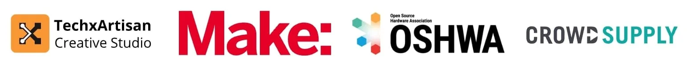
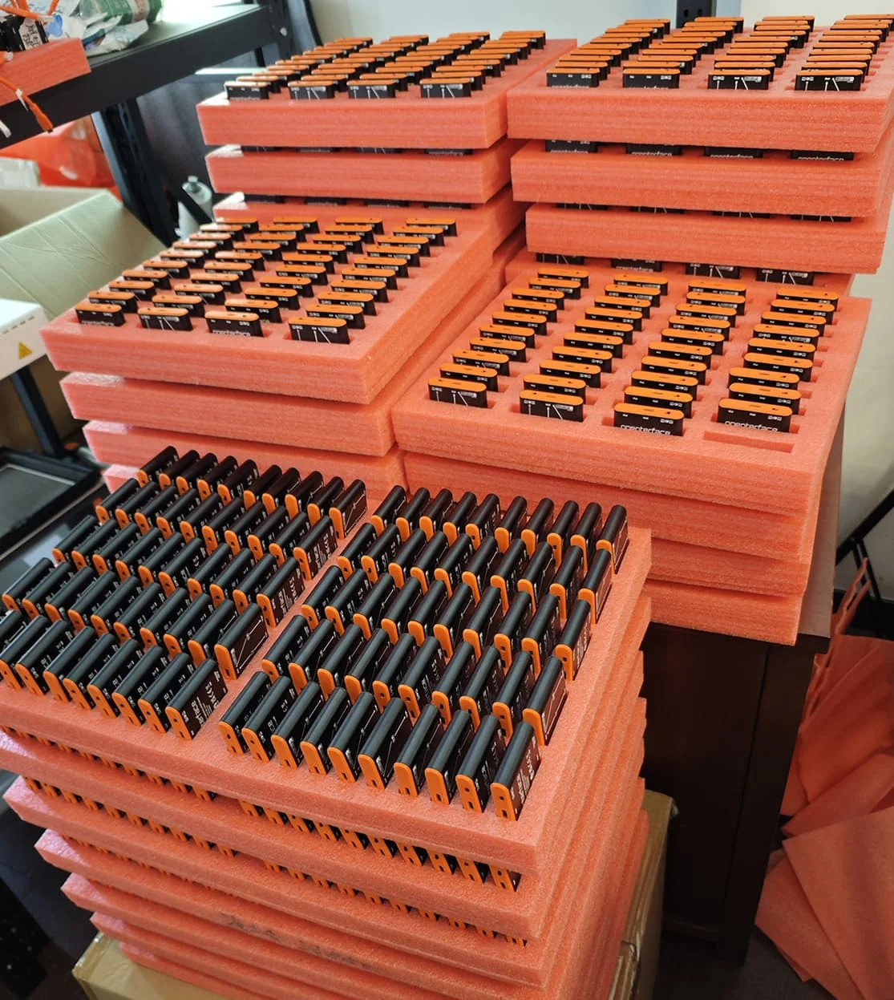

# Défi DIY, Prix Cool et Production Approche de la Ligne d'Arrivée !

Salut les passionnés d'Openterface !

Nous avons des nouvelles excitantes à partager ! D'un nouveau défi DIY palpitant aux étapes de production et aux mises à jour logicielles cool—ça bouge chez Openterface. Prenez un verre, installez-vous confortablement et plongez dans cette mise à jour avec nous !

## Défi DIY USB KVM 2024 : Libérez Votre Sorcier Technologique Intérieur !

Attention à tous les bricoleurs, créateurs et rêveurs ! Nous sommes ravis de présenter le Défi DIY USB KVM 2024, une collaboration avec TechxArtisan, Make: Magazine, l'Open Source Hardware Association (OSHWA) et Crowd Supply. C'est votre chance de créer une solution KVM personnalisée—voyons quelle magie vous pouvez concocter avec votre Openterface Mini-KVM !

### Voici le résumé :

**Mission :** Créez votre propre solution KVM ouverte en utilisant l'Openterface Mini-KVM, avec votre touche personnelle pour répondre à vos besoins spécifiques.

**Catégories :** Des prix pour les meilleurs performeurs incluent des récompenses pour les compétences techniques et la créativité, donc tout le monde a une chance !

**Prix Géniaux :**

- Un Openterface Mini-KVM en édition limitée avec un boîtier transparent et argenté.
- Le futuriste Pi-Cast KVM par HackerGadgets.
- Le GameShell inspiré du rétro par Clockwork.

**Calendrier :** Le défi commence le 1er octobre 2024 et les soumissions se terminent le 28 février 2025.

**Juges :** Des experts de TechxArtisan, Make: Magazine, OSHWA et Crowd Supply évalueront vos projets.

Que vous soyez un sorcier technologique chevronné ou que vous fassiez vos premiers pas dans le monde du hacking matériel, ce concours est votre terrain de jeu. Qui sait ? Vous pourriez créer la prochaine grande innovation technologique !

Rejoignez l'action sur [la page officielle du concours de Crowd Supply](https://www.crowdsupply.com/techxartisan/usb-kvm-diy-challenge-2024) et discutez avec nous sur le [canal Discord du concours](https://discord.com/invite/YhKVzDujkT). **Que les jeux de l'innovation commencent !**

<small><em>Openterface Mini-KVM disponible en trois boîtiers cool—transparent, argenté et noir</em></small>

<small><em>Certains des prix géniaux : Pi-Cast KVM par HackerGadgets et GameShell par Clockwork</em></small>

## Mise à Jour de la Production : Presque Là !

Voici un aperçu du travail acharné en coulisses—notre studio bourdonne comme une ruche ! Jusqu'à présent, nous avons assemblé 800 unités de l'Openterface Mini-KVM.

Notre contrôle de qualité est de premier ordre. Chaque unité est vérifiée, revérifiée et choyée par notre équipe pour s'assurer que lorsqu'elle arrive entre vos mains, elle n'est pas seulement bonne—elle est excellente ! Nous visons une qualité qui rend les autres appareils verts de jalousie.

Nous savons que l'attente peut être difficile, mais nous nous engageons à offrir la meilleure expérience possible. Merci pour votre patience pendant que nous apportons les touches finales !

## Mise à Jour Logicielle : L'Application Android Reçoit une Belle Mise à Jour

Notre application Android vient de recevoir une mise à jour majeure. Contrôler vos appareils cibles via votre téléphone ou tablette n'a jamais été aussi facile ou amusant !

Découvrez la vidéo de démonstration ici : [Vidéo de Démonstration de l'Application Android](https://x.com/TechxArtisan/status/1840587612148699398)

### Voici les nouveautés :
- Contrôles tactiles fluides et réactifs
- Fonctionnalité de glisser-déposer facile
- Tapping précis pour une expérience intuitive
- Une nouvelle barre de touches de fonction pour plus de commodité
- Fonctionnalité à venir : raccourcis clavier personnalisables
- Compatible avec les tablettes et téléphones Android

Cette application rend l'Openterface Mini-KVM encore plus utile pour les pros de la technologie en déplacement. Nous avons également téléchargé le dernier APK et le code source sur notre dépôt GitHub si vous souhaitez explorer davantage ou contribuer !

## Pour Conclure

Ouf ! C'était une sacrée mise à jour, non ?

Si vous avez des idées, des retours ou des rêves fous de KVM, nous voulons les entendre ! Glissez-vous dans nos DMs, envoyez un pigeon voyageur 🕊️, ou rejoignez l'un de nos canaux communautaires. Nous adorons vous connecter !

Merci encore pour votre patience et pour être la meilleure communauté technologique qui soit. Nous avons encore plus de nouvelles et de mises à jour passionnantes à venir—restez à l'écoute !

Avec gratitude,  
Billy Wang  
Chef de Produit  
Équipe Openterface | TechxArtisan

