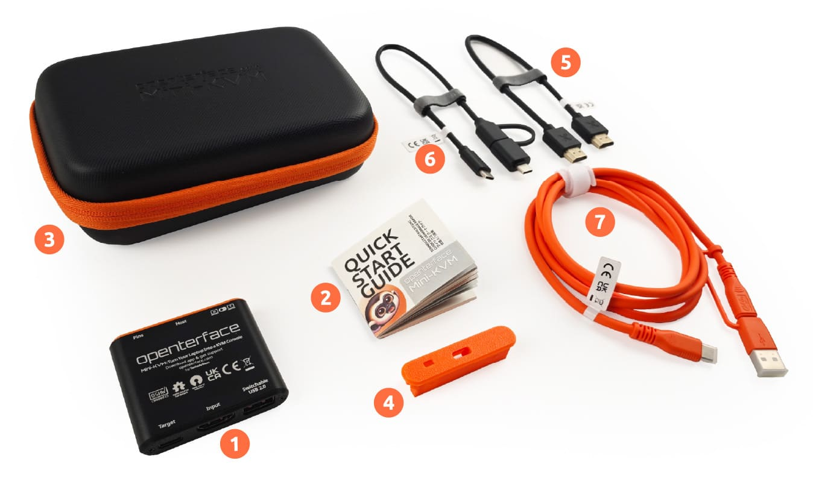

# Contenu de la Boîte

Découvrez nos deux options d'achat conçues pour répondre à vos besoins, que vous recherchiez l'essentiel ou un ensemble complet d'outils.

## Pack 1 : Pack de Base

{:style="width:680px"}

1. Produit principal : Openterface Mini-KVM
2. Guide de démarrage rapide

## Pack 2 : Pack d'Outils

{:style="width:680px"}

1. Produit principal : Openterface Mini-KVM
2. Guide de démarrage rapide
3. Sac à outils (165 x 110 x 50mm)
4. Capuchon d'extension de broche
5. Câble HDMI mâle-mâle (30cm)
6. Câble Type-C mâle vers USB-A mâle (0,3m) avec adaptateur USB-A femelle vers USB-C mâle
7. Câble Type-C mâle-mâle (1,5m) avec adaptateur USB-C femelle vers USB-A mâle

{:style="width:680px"}